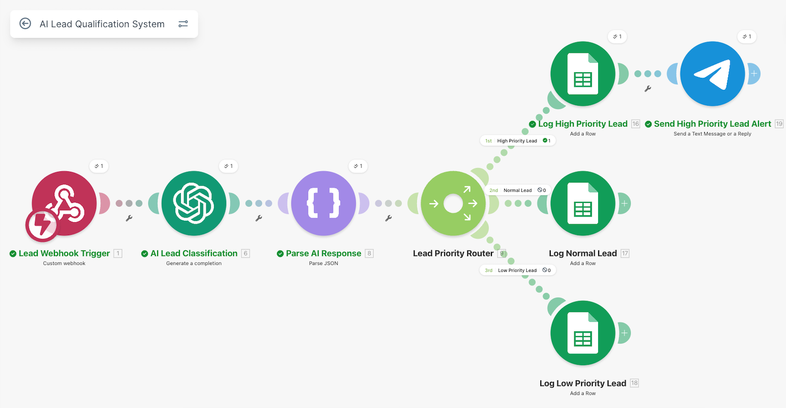
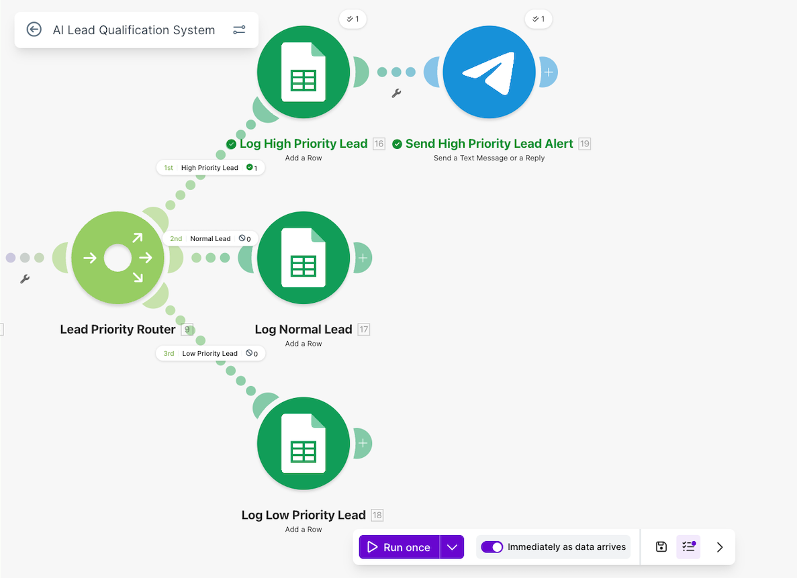
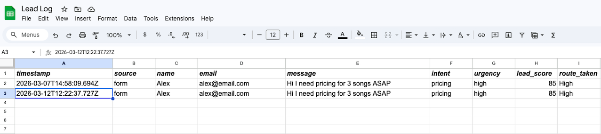

# AI Lead Qualification System

## 🎥 Demo Video

Short walkthrough of the system and how it works:

👉 [▶️ Watch Demo Video](https://www.loom.com/share/4f232efe06224b9abc1340f28c3114aa) 

## Problem

Businesses often receive many inbound leads through forms, chat systems, or APIs.  
Reviewing and prioritizing each lead manually can be slow and inefficient, especially when only a small portion of leads require immediate attention.

## Solution

This automation uses **AI classification and workflow routing** to automatically evaluate inbound leads.

When a lead arrives through a webhook, the system sends the message to **OpenAI** for analysis.  
The AI classifies the lead's **intent, urgency, and lead score**, and the workflow routes the lead to the appropriate path.

All leads are stored in **Google Sheets**, while **high-priority leads trigger an instant Telegram alert**.

## 🧱 Architecture

Webhook → OpenAI → JSON Parsing → Router → Google Sheets → Telegram

This workflow processes incoming leads, classifies them using AI, and routes them based on priority.

## 🛠 Tech Stack

- Make (Integromat)
- OpenAI API (GPT)
- Google Sheets
- Telegram Bot API
- Webhooks

  

## 🚀 Key Features

- Automatic lead classification using AI  
- Lead scoring based on urgency and intent  
- Priority-based routing (high, medium, low)  
- Real-time Telegram alerts for high-priority leads  
- Structured data storage in Google Sheets  

The system prioritizes leads using AI classification, ensuring that high-value opportunities are identified and handled immediately.

## Outcome

This system automates lead prioritization, ensuring that high-value opportunities are handled first while reducing manual effort.

## Possible Improvements

In a production environment, this system could be extended by replacing Google Sheets with more scalable solutions such as:

- CRM systems (HubSpot, Salesforce)
- Databases (PostgreSQL, Airtable)
- Lead management platforms
- Integration with CRM systems for automated follow-up workflows

## Screenshots

### Automation Architecture

### Router Logic

### Example Output

