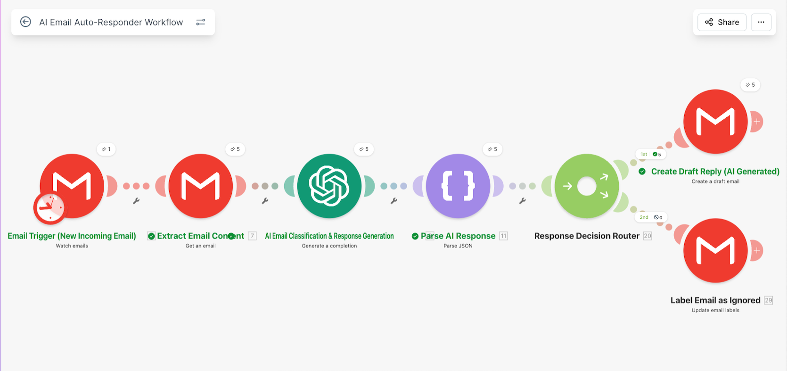
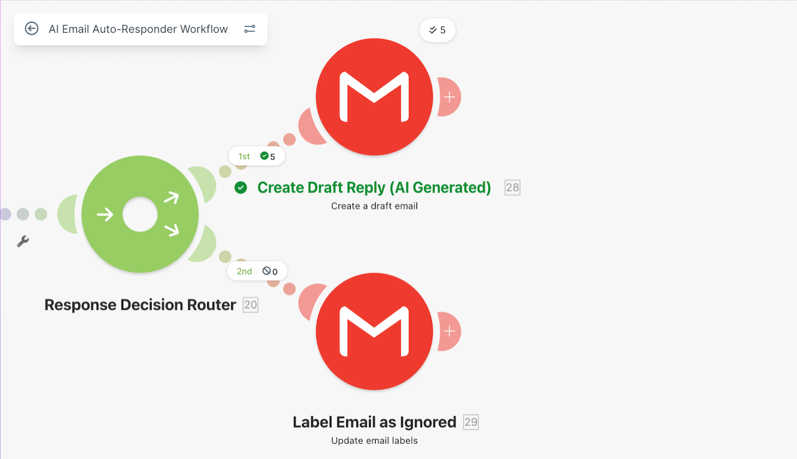
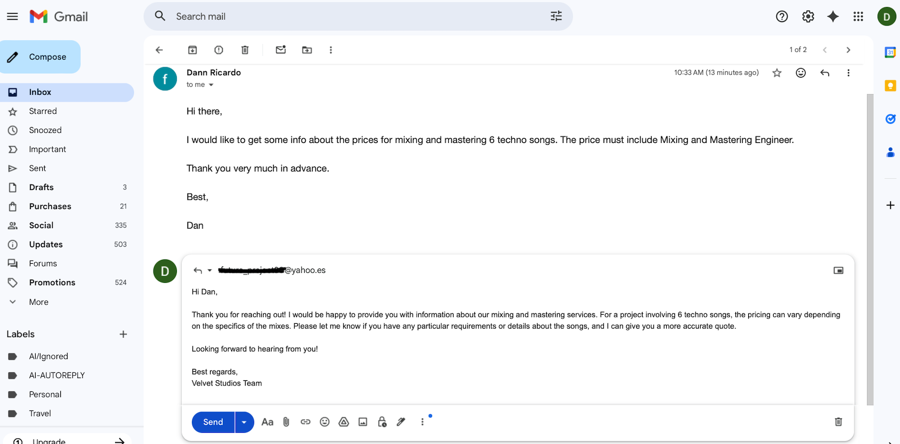

# 📧 AI Email Auto-Responder System

## 🎥 Demo Video

Short walkthrough of the system and how it works:

👉 [▶️ Watch Demo Video](https://www.loom.com/share/8ac0332bd36f4fc99840d3a1fa38a016))

## 🧩 Problem

Businesses receive a large volume of emails, many of which are repetitive or low-priority.  
Manually reviewing, categorizing, and responding to each message can be time-consuming and inefficient.

## 💡 Solution

This automation uses AI-powered classification and response generation to streamline email handling.

When a new email arrives in Gmail, the system extracts the content and sends it to OpenAI for analysis.  
The AI classifies the message based on intent and determines whether a response is required.

If a reply is needed, the system generates a contextual response and creates a draft email in Gmail for human review.  
If not, the email is automatically labeled and stored for reference.

This approach reduces manual workload while maintaining human control over outgoing communication, ensuring quality and consistency.

## 🧱 Architecture

Gmail Trigger → Extract Email → OpenAI → JSON Parsing → Router → Gmail Draft / Label

This workflow processes incoming emails, classifies intent using AI, and routes them to either draft responses or automated labeling.

This modular design allows easy extension to CRM systems, databases, or additional communication channels.

## 🛠 Tech Stack

- Make (Integromat)  
- OpenAI API (GPT)  
- Gmail API  
- Webhooks

This stack enables scalable and modular automation workflows using no-code/low-code tools combined with AI services.

## 🚀 Key Features

- Automatic email classification using AI  
- AI-generated contextual responses  
- Conditional routing (reply vs ignore)  
- Draft email creation for human review  
- Automatic labeling for ignored emails

This system ensures that only relevant emails require human attention, significantly improving operational efficiency and response consistency.

## 📈 Outcome

This system automates email triage and response generation, significantly reducing manual workload while ensuring consistent and context-aware communication.

By combining AI classification with controlled response drafting, the system enables faster handling of incoming emails while maintaining quality and consistency.

## 🔮 Possible Improvements

In a production environment, this system could be extended by:

- Integrating with CRM systems (HubSpot, Salesforce)  
- Adding sentiment analysis for better prioritization  
- Auto-sending responses for low-risk scenarios  
- Storing conversations in a database (PostgreSQL, Airtable)  
- Building analytics dashboards for email trends  

## 📸 Screenshots

### Automation Architecture

### Router Logic

### Example Output (Gmail Draft)

