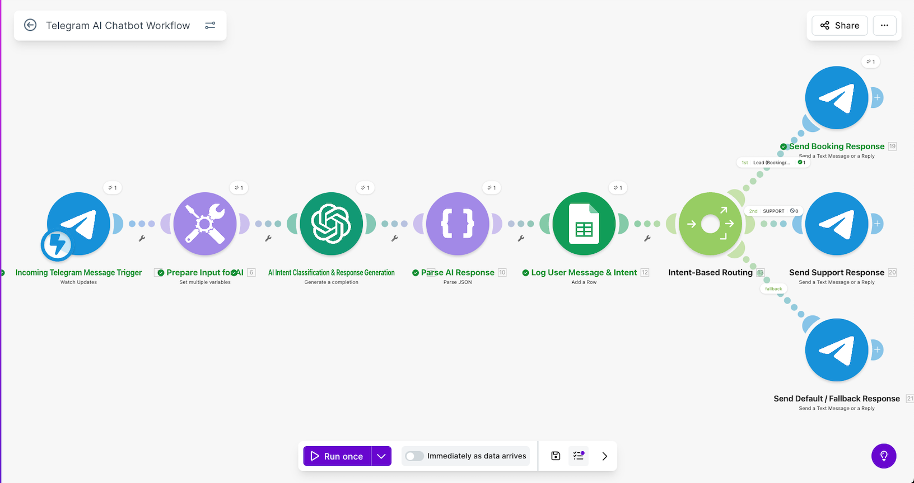

# 🤖 AI Telegram Chatbot with Intent Routing

## 🎥 Demo Video

Short walkthrough of the system and how it works:

👉 [▶️ Watch Demo Video](https://www.loom.com/share/42a9d0174df54f97813f2abae811ca06)

---

## 🧩 Problem

Many businesses need a simple and fast way to interact with automation systems.

While backend workflows can process data efficiently, triggering them usually requires dashboards, APIs, or manual input.

Messaging platforms like Telegram provide a more accessible interface for real-time interaction.

---

## 💡 Solution

This project connects a Telegram chatbot with a Make automation workflow.

When a user sends a message, the system receives it, processes it using OpenAI, and generates a response.

The response is then sent back to the user via Telegram, creating a real-time conversational interface.

---

## 🧱 Architecture

Telegram → Make → OpenAI → Telegram

This workflow processes incoming messages and returns AI-generated responses in real time.

---

## 🛠️ Tools Used

- Make (Integromat)
- Telegram Bot API
- OpenAI API

---

## 🔁 Key Logic

1. User sends a message via Telegram  
2. Message is received by Make  
3. Message is sent to OpenAI  
4. AI generates a response  
5. Response is sent back via Telegram  

---

## 📈 Outcome

This system demonstrates how messaging platforms can be used as simple interfaces for automation workflows.

It enables real-time interaction and provides a foundation for building conversational automation systems.

---

## 🔮 Possible Improvements

- Add conversation memory for context-aware responses  
- Implement command handling (/start, /help, etc.)  
- Integrate with databases or external tools  
- Expand routing logic for different use cases  

---

## 📸 Screenshots

### Automation Architecture

### Workflow (Make Scenario)

### Example Interaction

