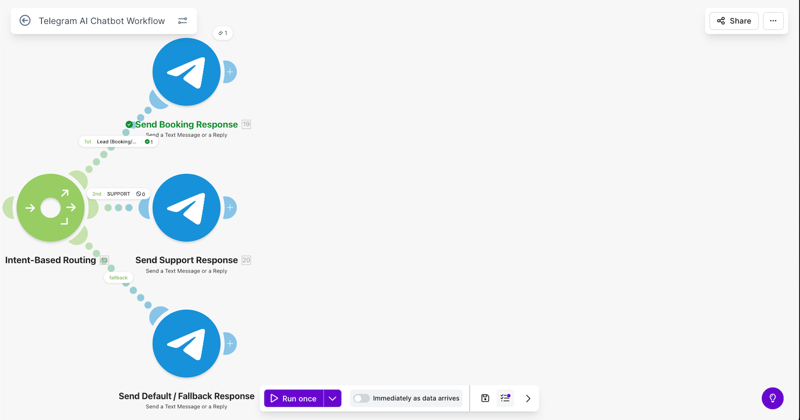

# AI Telegram Chatbot with Intent Routing

## Problem

Businesses and automation systems often require a simple interface to interact with automated workflows. Messaging platforms like Telegram can serve as a convenient way to send requests, receive information, or trigger automated processes.

---

## Solution

This project integrates a **Telegram chatbot** with a Make automation workflow.

When a user sends a message to the Telegram bot, the automation receives the message and processes it using **OpenAI**. The system then generates an appropriate response and sends it back to the user through Telegram.

This creates a simple conversational interface for interacting with automated workflows.

---

## Architecture
Telegram Message → Make Scenario → OpenAI Processing → Telegram Response

---

## Tools Used

- Make (Integromat)
- Telegram Bot API
- OpenAI API

---

## Key Logic

The workflow processes incoming Telegram messages as triggers.

1️⃣ User sends a message to the Telegram bot  

2️⃣ Make receives the message and extracts the text  

3️⃣ The message is sent to OpenAI for processing  

4️⃣ OpenAI generates a response  

5️⃣ The response is sent back to the user via Telegram  

---

## Outcome

This project demonstrates how messaging platforms can be integrated with AI services and automation workflows to create simple conversational interfaces.

Such systems can be used for:

- automation control interfaces  
- quick information retrieval  
- AI-assisted chat systems  

---

## Possible Improvements

Possible production improvements include:

- conversation memory
- command handling
- integration with databases or internal tools

- ## Screenshots

### Automation Architecture

### Router Logic

### Example Output (Telegram Bot)

