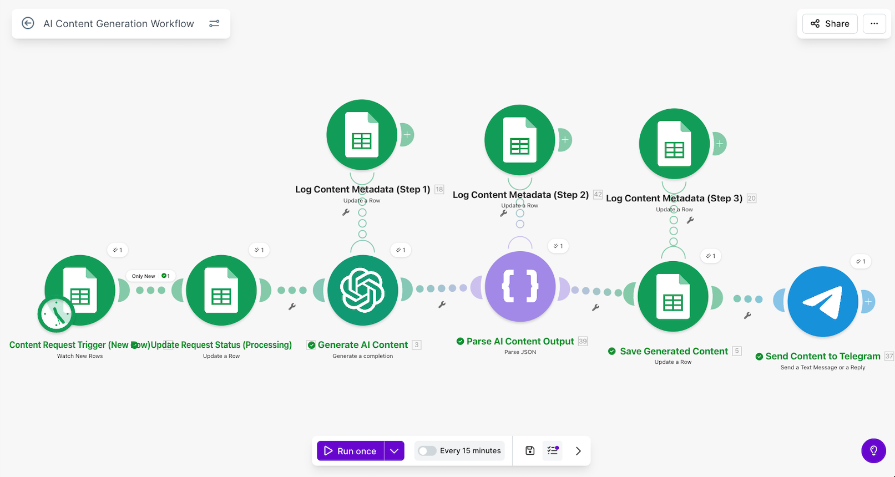
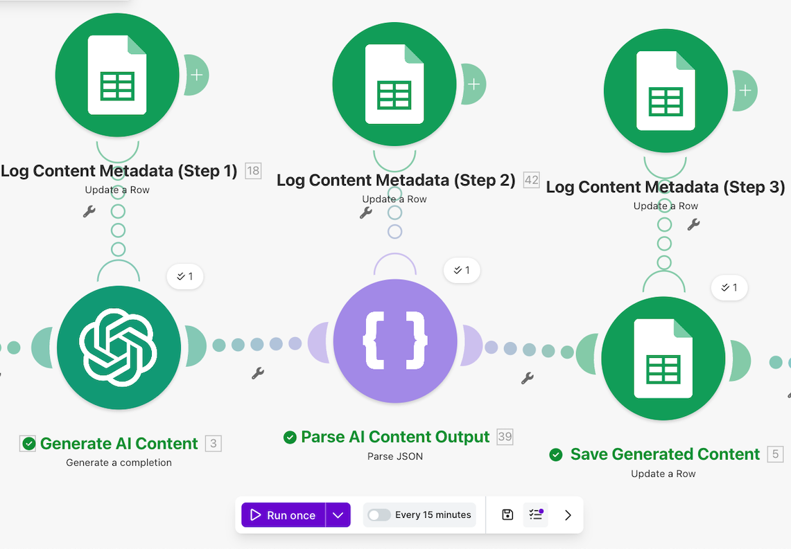

# ✍️ AI Content Generation & Distribution System (Automated Content Pipeline)

## 🎥 Demo Video

Short walkthrough of the system and how it works:

👉 [▶️ Watch Demo Video](https://www.loom.com/share/ef67952808ef45ffab1025ac888e3695)

## 🧩 Problem

Content creation for marketing, social media, and communication channels is time-consuming and repetitive.

Teams often need to produce large volumes of content quickly, while maintaining consistency and quality.

Manual workflows slow down production and make it difficult to scale content output efficiently.

## 💡 Solution

This automation uses AI-powered content generation to create structured content drafts from a trigger event.

When the workflow is triggered, the system sends a prompt to OpenAI, generates structured content, formats the output, and delivers the result through Telegram for review.

This system acts as a scalable content generation pipeline, enabling rapid content creation with minimal manual effort.

## 🧱 Architecture

Trigger → Prompt Generation → OpenAI → Structured Output → Formatting → Telegram Delivery

This workflow processes content requests, generates AI-powered drafts, formats the output, and delivers it for review.

This modular architecture allows the system to be extended with additional publishing channels, approval steps, or content storage tools.

## 🛠 Tech Stack

- Make (Integromat)
- OpenAI API (GPT)
- Telegram Bot API
- JSON Parsing / Structured Output Handling
- Webhooks

## 🚀 Key Features

- AI-powered content generation
- Structured prompt-based workflow
- Formatted output for review
- Telegram delivery for quick approval
- Modular design for multi-channel distribution

This system helps reduce manual content creation effort while supporting consistent content production.

## 📈 Outcome

This system demonstrates how AI can be integrated into automation workflows to create scalable content generation pipelines.

It reduces manual effort, accelerates content production, and provides a flexible foundation for multi-channel content distribution.

## 🧠 Possible Improvements

In a production environment, this system could be extended by:

- Multi-platform publishing (LinkedIn, Twitter, blogs)
- Content approval and review workflows
- Scheduled content pipelines
- Integration with CMS or marketing tools
- Content performance tracking and analytics

## 📸 Screenshots

### Automation Architecture

### Content Processing Flow

### Example Output

